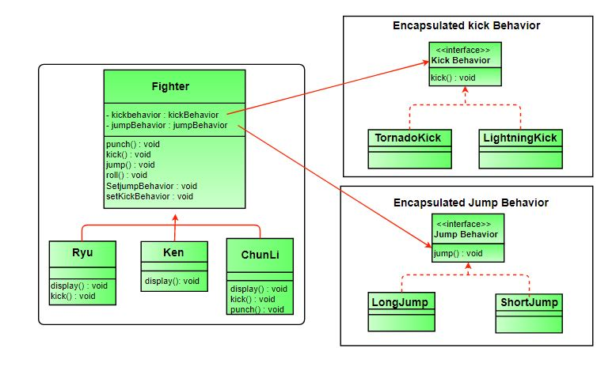

# Design pattern revision


## Factory method


* Type: `creational design pattern`

* In Factory pattern, we create object without exposing the creation logic to client and the client use the same common interface to create new type of object.
* The idea is to use a static member-function (static factory method) which creates & returns instances, hiding the details of class modules from user.

Example:
> Say, in a ‘Drawing’ system, depending on user’s input, different pictures like square, rectangle, circle can be drawn. Here we can use factory method to create instances depending on user’s input. For adding new type of shape, no need to change client’s code.


## Observer Pattern

> Publishers + Subcribers = Oserver Pattern

* When to use: You should consider using this pattern in your application when multiple objects are dependent on the state of one object as it provides a neat and well tested design for the same.

* Example: Social media, RSS feeds, email subscription in which you have the option to follow or subscribe and you receive latest notification.


## Singleton 

> The singleton pattern is a design pattern that restricts the instantiation of a class to one object. 

### Method 1: Classic Implementation 
```Java
// Classical Java implementation of singleton
// design pattern
class Singleton
{
    private static Singleton obj;
 
    // private constructor to force use of
    // getInstance() to create Singleton object
    private Singleton() {}
 
    public static Singleton getInstance()
    {
        if (obj==null)
            obj = new Singleton();
        return obj;
    }
}
```
*Note: Not safe for multithread*


### Method 2: make getInstance() synchronized 

```Java
// Thread Synchronized Java implementation of
// singleton design pattern
class Singleton
{
    private static Singleton obj;
 
    private Singleton() {}
 
    // Only one thread can execute this at a time
    public static synchronized Singleton getInstance()
    {
        if (obj==null)
            obj = new Singleton();
        return obj;
    }
}
```
*Note: Solve the problem of method 1, but decrease the perfomance*


### Method 3: Eager Instantiation 

```Java
// Static initializer based Java implementation of
// singleton design pattern
class Singleton
{
    private static Singleton obj = new Singleton();
 
    private Singleton() {}
 
    public static Singleton getInstance()
    {
        return obj;
    }
}
```

### Method 4 (Best): Use “Double Checked Locking” 

```java

// Double Checked Locking based Java implementation of
// singleton design pattern
class Singleton
{
    private static volatile Singleton obj  = null;
 
    private Singleton() {}
 
    public static Singleton getInstance()
    {
        if (obj == null)
        {
            // To make thread safe
            synchronized (Singleton.class)
            {
                // check again as multiple threads
                // can reach above step
                if (obj==null)
                    obj = new Singleton();
            }
        }
        return obj;
    }
}
```

*Note: This method drastically reduces the overhead of calling the synchronized method every time.*

> Example: Hardware interface access: The use of singleton depends on the requirements. Singleton classes are also used to prevent concurrent access of class. Practically singleton can be used in case external hardware resource usage limitation required e.g. Hardware printers where the print spooler can be made a singleton to avoid multiple concurrent accesses and creating deadlock.


## Decorator Pattern

> The decorator pattern attaches additional responsibilities to an object dynamically. Decorators provide a flexible alternative to subclassing for extending functionality.


*Example:*


*Code:*
```Java
// Java program to demonstrate Decorator
// pattern

// Abstract Pizza class (All classes extend
// from this)
abstract class Pizza
{
	// it is an abstract pizza
	String description = "Unkknown Pizza";

	public String getDescription()
	{
		return description;
	}

	public abstract int getCost();
}

// The decorator class : It extends Pizza to be
// interchangable with it topings decorator can
// also be implemented as an interface
abstract class ToppingsDecorator extends Pizza
{
	public abstract String getDescription();
}

// Concrete pizza classes
class PeppyPaneer extends Pizza
{
	public PeppyPaneer() { description = "PeppyPaneer"; }
	public int getCost() { return 100; }
}
class FarmHouse extends Pizza
{
	public FarmHouse() { description = "FarmHouse"; }
	public int getCost() { return 200; }
}
class Margherita extends Pizza
{
	public Margherita() { description = "Margherita"; }
	public int getCost() { return 100; }
}
class ChickenFiesta extends Pizza
{
	public ChickenFiesta() { description = "ChickenFiesta";}
	public int getCost() { return 200; }
}
class SimplePizza extends Pizza
{
public SimplePizza() { description = "SimplePizza"; }
public int getCost() { return 50; }
}

// Concrete toppings classes
class FreshTomato extends ToppingsDecorator
{
	// we need a reference to obj we are decorating
	Pizza pizza;

	public FreshTomato(Pizza pizza) { this.pizza = pizza; }
	public String getDescription() {
		return pizza.getDescription() + ", Fresh Tomato ";
	}
	public int getCost() { return 40 + pizza.getCost(); }
}
class Barbeque extends ToppingsDecorator
{
	Pizza pizza;
	public Barbeque(Pizza pizza) { this.pizza = pizza; }
	public String getDescription() {
		return pizza.getDescription() + ", Barbeque ";
	}
	public int getCost() { return 90 + pizza.getCost(); }
}
class Paneer extends ToppingsDecorator
{
	Pizza pizza;
	public Paneer(Pizza pizza) { this.pizza = pizza; }
	public String getDescription() {
		return pizza.getDescription() + ", Paneer ";
	}
	public int getCost() { return 70 + pizza.getCost(); }
}

// Other toppings can be coded in a similar way

// Driver class and method
class PizzaStore
{
	public static void main(String args[])
	{
		// create new margherita pizza
		Pizza pizza = new Margherita();
		System.out.println( pizza.getDescription() +
						" Cost :" + pizza.getCost());

		// create new FarmHouse pizza
		Pizza pizza2 = new FarmHouse();

		// decorate it with freshtomato topping
		pizza2 = new FreshTomato(pizza2);

		//decorate it with paneer topping
		pizza2 = new Paneer(pizza2);

		System.out.println( pizza2.getDescription() +
						" Cost :" + pizza2.getCost());
		Pizza pizza3 = new Barbeque(null); //no specific pizza
		System.out.println( pizza3.getDescription() + " Cost :" + pizza3.getCost());
}
}
```
**Advantages:**
* The decorator pattern can be used to make it possible to extend (decorate) the functionality of a certain object at runtime.
* The decorator pattern is an alternative to subclassing. Subclassing adds behavior at compile time, and the change affects all instances of the original class; decorating can provide new behavior at runtime for individual objects.
* Decorator offers a pay-as-you-go approach to adding responsibilities. Instead of trying to support all foreseeable features in a complex, customizable class, you can define a simple class and add functionality incrementally with Decorator objects.


## Strategy Pattern

> Strategy pattern (also known as the policy pattern) is a software design pattern that enables an algorithm’s behavior to be selected at runtime. The strategy pattern: 
>* defines a family of algorithms
>* encapsulates each algorithm
>* makes the algorithms interchangeable within that family

*Example:*



*Code:*
```Java
// Java program to demonstrate implementation of
// Strategy Pattern

// Abstract as you must have a specific fighter
abstract class Fighter
{
	KickBehavior kickBehavior;
	JumpBehavior jumpBehavior;

	public Fighter(KickBehavior kickBehavior,
				JumpBehavior jumpBehavior)
	{
		this.jumpBehavior = jumpBehavior;
		this.kickBehavior = kickBehavior;
	}
	public void punch()
	{
		System.out.println("Default Punch");
	}
	public void kick()
	{
		// delegate to kick behavior
		kickBehavior.kick();
	}
	public void jump()
	{

		// delegate to jump behavior
		jumpBehavior.jump();
	}
	public void roll()
	{
		System.out.println("Default Roll");
	}
	public void setKickBehavior(KickBehavior kickBehavior)
	{
		this.kickBehavior = kickBehavior;
	}
	public void setJumpBehavior(JumpBehavior jumpBehavior)
	{
		this.jumpBehavior = jumpBehavior;
	}
	public abstract void display();
}

// Encapsulated kick behaviors
interface KickBehavior
{
	public void kick();
}
class LightningKick implements KickBehavior
{
	public void kick()
	{
		System.out.println("Lightning Kick");
	}
}
class TornadoKick implements KickBehavior
{
	public void kick()
	{
		System.out.println("Tornado Kick");
	}
}

// Encapsulated jump behaviors
interface JumpBehavior
{
	public void jump();
}
class ShortJump implements JumpBehavior
{
	public void jump()
	{
		System.out.println("Short Jump");
	}
}
class LongJump implements JumpBehavior
{
	public void jump()
	{
		System.out.println("Long Jump");
	}
}

// Characters
class Ryu extends Fighter
{
	public Ryu(KickBehavior kickBehavior,
			JumpBehavior jumpBehavior)
	{
		super(kickBehavior,jumpBehavior);
	}
	public void display()
	{
		System.out.println("Ryu");
	}
}
class Ken extends Fighter
{
	public Ken(KickBehavior kickBehavior,
			JumpBehavior jumpBehavior)
	{
		super(kickBehavior,jumpBehavior);
	}
	public void display()
	{
		System.out.println("Ken");
	}
}
class ChunLi extends Fighter
{
	public ChunLi(KickBehavior kickBehavior,
				JumpBehavior jumpBehavior)
	{
		super(kickBehavior,jumpBehavior);
	}
	public void display()
	{
		System.out.println("ChunLi");
	}
}

// Driver class
class StreetFighter
{
	public static void main(String args[])
	{
		// let us make some behaviors first
		JumpBehavior shortJump = new ShortJump();
		JumpBehavior LongJump = new LongJump();
		KickBehavior tornadoKick = new TornadoKick();

		// Make a fighter with desired behaviors
		Fighter ken = new Ken(tornadoKick,shortJump);
		ken.display();

		// Test behaviors
		ken.punch();
		ken.kick();
		ken.jump();

		// Change behavior dynamically (algorithms are
		// interchangeable)
		ken.setJumpBehavior(LongJump);
		ken.jump();
	}
}
```